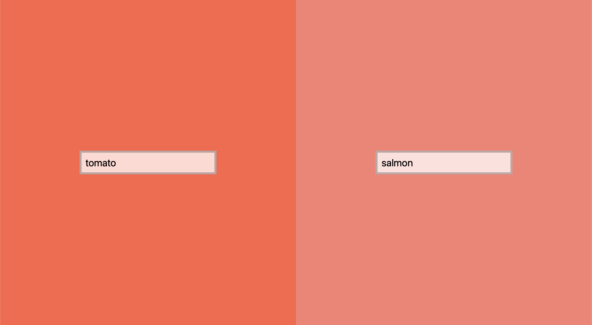

Compare Colors is a super simple tool for comparing two colors side-by-side.

<!--more-->



## Motivation

While working on a color palette for a design system at work, I needed to compare some hex color codes to see if they looked any different in the wild. After messing around a bit in the browser developer tools, and trying to change the background color of some adjacent divs, I thought there must be a better way. I'm sure there is a plenitude of tools I could have used to achieve what I wanted, but this was a perfect opportunity to take a little detour from work and make my own little color comparison tool.

## Implementation

For this simple use case, I wanted to keep the code as simple as possible, too. I started with a couple of divs, each containing a single text input field. And that was about it for the HTML.

```html
<body>
  <div id="div1">
    <input />
  </div>
  <div id="div2">
    <input />
  </div>
</body>
```

For the styling, just a few CSS rules for `body`, `div`, and `input` were necessary. Namely, defining the whole body as a full-screen grid, centering the input fields inside the divs, and adding some styling for them.

```css
body {
  display: grid;
  grid-template-columns: 1fr 1fr;
  height: 100vh;
  margin: 0;
}

div {
  display: flex;
  align-items: center;
  justify-content: center;
  padding: 5px;
}

input {
  padding: 10px;
  border: 5px solid rgba(0, 0, 0, 0.25);
  background-color: rgba(255, 255, 255, 0.75);
  font-size: 25px;
}
```

For the functionality, a couple of JavaScript functions were needed. The beef is in the `setBackgroundColors` function, which gets the colors from the input fields and sets the background colors for the corresponding divs. As a nice-to-have bonus, `setSearchParams` stores the values as search parameters in the URL for saving or sharing your color comparison via linking. An event listener is registered for both of the input fields which calls the mentioned functions when the field value changes.

The single most difficult decision I had to make while working on the tool was to decide the default colors the user sees when they open the tool. I went with [a ceviche-inspired palette](https://jtiala.github.io/compare-colors/?1=tomato&2=salmon) of `tomato` and `salmon`. Another good one would have been `gray` and `darkgray` because [they make so much sense](https://jtiala.github.io/compare-colors/?1=gray&2=darkgray).

```js
const defaultColor1 = "tomato";
const defaultColor2 = "salmon";

const div1 = document.querySelector("#div1");
const div2 = document.querySelector("#div2");
const input1 = document.querySelector("#div1 input");
const input2 = document.querySelector("#div2 input");

input1.addEventListener("change", eventListener);
input2.addEventListener("change", eventListener);

setInitialColors();

function eventListener() {
  setBackgroundColors(input1.value, input2.value);
  setSearchParams(input1.value, input2.value);
}

function setBackgroundColors(color1, color2) {
  div1.style.background = color1;
  div2.style.background = color2;
}

function setInputValues(color1, color2) {
  input1.value = color1;
  input2.value = color2;
}

function setSearchParams(color1, color2) {
  const searchParams = new URLSearchParams(window.location.search);

  searchParams.set("1", color1);
  searchParams.set("2", color2);

  history.pushState(
    null,
    "",
    `${window.location.pathname}?${searchParams.toString()}`
  );
}

function setInitialColors() {
  const searchParams = new URLSearchParams(document.location.search);
  const color1 = searchParams.get("1") || defaultColor1;
  const color2 = searchParams.get("2") || defaultColor2;

  setInputValues(color1, color2);
  setBackgroundColors(color1, color2);
}
```

Since the code is just vanilla JS and CSS, no build steps are needed. Therefore deploying the tool to GitHub Pages is also super simple: just set Pages to deploy from the main branch and everything should be good to go.

## Conclusion

Creating this tool was a nice little break for my work day. It took maybe half an hour while sipping on a cup of coffee. In fact, writing this blog post took more effort than the actual code it's about.

There are a lot of improvements that could be made here. At the moment, the input fields accept any string and set that string as the value for the CSS `background` property. Some validation could be nice.

Other features that crossed my mind are a button for adding more than two colors and an info layer about the selected colors showing their code in hex, RGB, and other formats.

Maybe I'll revisit this side project in a coffee break somewhere in the future. Maybe not. Probably not.
